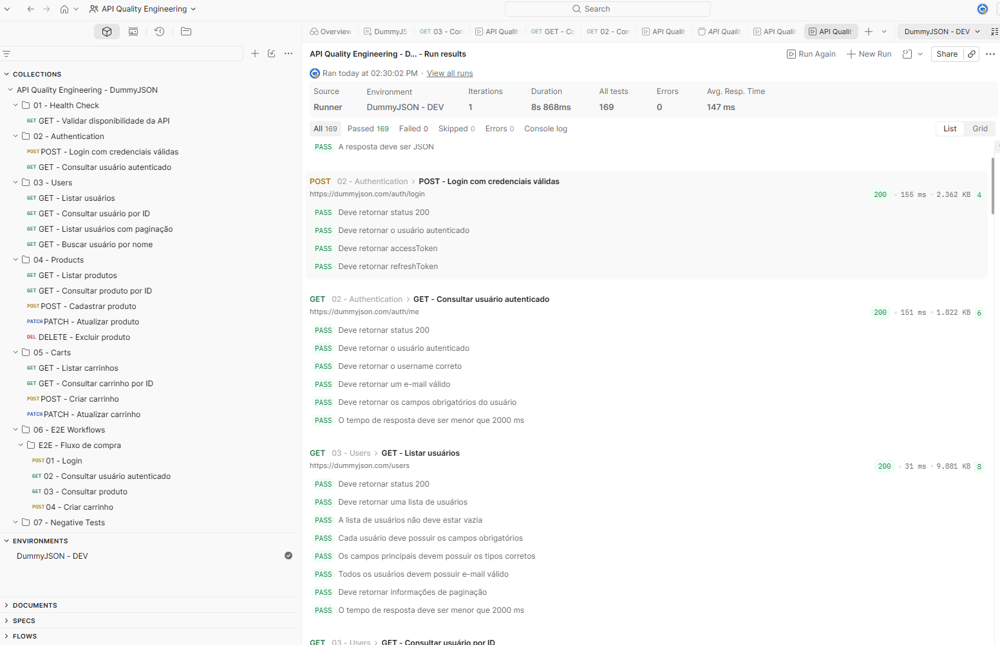
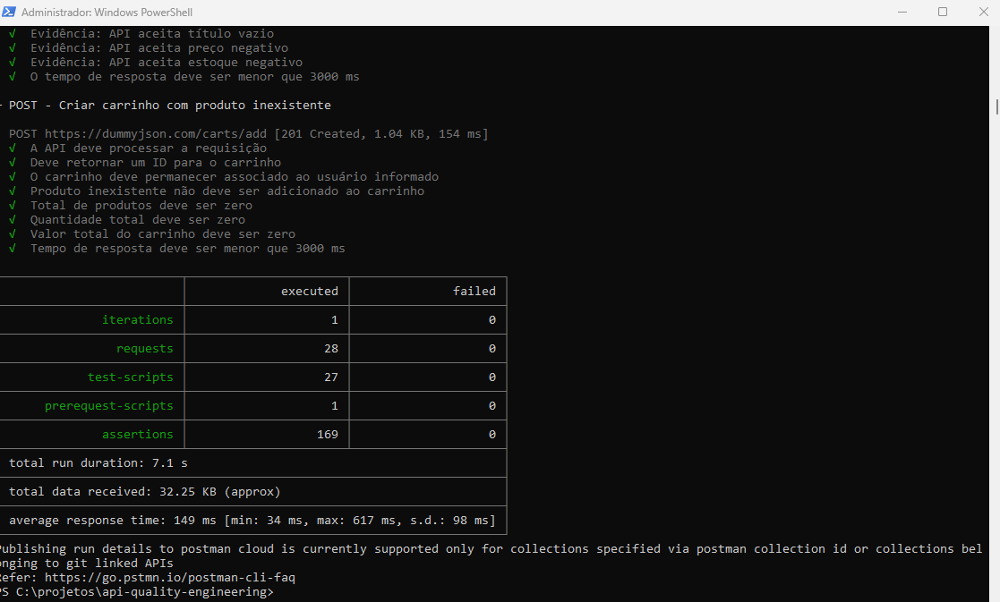
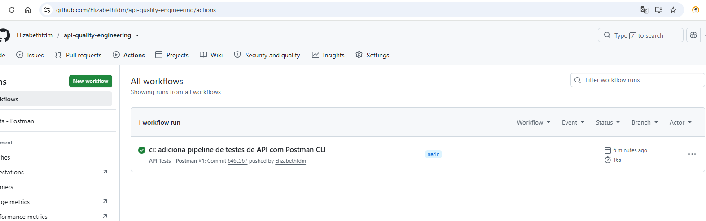

# 🧪 API Quality Engineering — DummyJSON


Projeto de **Quality Engineering focado em testes automatizados de API**, desenvolvido utilizando Postman, JavaScript, Postman CLI e GitHub Actions.

O objetivo não é apenas validar endpoints isoladamente, mas demonstrar uma abordagem estruturada de qualidade envolvendo testes funcionais, regras de negócio, autenticação, cenários negativos, fluxos E2E, gerenciamento de dados, validações de contrato e execução automatizada em pipeline CI.

---

## 🎯 Objetivo do projeto

Construir uma suíte de testes de API organizada, reutilizável e executável automaticamente, utilizando a API pública DummyJSON como aplicação sob teste.

O projeto explora práticas aplicadas no dia a dia de Quality Engineering:

- testes funcionais de API;
- validação de status HTTP;
- validação de payloads JSON;
- validação de tipos e campos obrigatórios;
- regras de negócio;
- autenticação e tokens;
- testes negativos;
- testes de integração;
- fluxos End-to-End;
- gerenciamento de variáveis de ambiente;
- validação de tempo de resposta;
- execução via linha de comando;
- integração contínua com GitHub Actions.

---

## 🛠️ Tecnologias utilizadas

| Tecnologia | Utilização |
|---|---|
| Postman | Criação e organização da suíte de testes |
| JavaScript | Assertions e validações automatizadas |
| Postman CLI | Execução da suíte via terminal |
| Git | Controle de versão |
| GitHub | Hospedagem do projeto |
| GitHub Actions | Pipeline de integração contínua |
| DummyJSON | API utilizada como sistema sob teste |

---

## 🏗️ Estrutura do projeto

```text
api-quality-engineering/
│
├── .github/
│   └── workflows/
│       └── api-tests.yml
│
├── postman/
│   ├── collections/
│   │   └── API Quality Engineering - DummyJSON.postman_collection.json
│   │
│   └── environments/
│       └── DummyJSON-DEV.postman_environment.json
│
├── docs/
│   └── evidencias/
│       ├── postman-runner-success.png
│       ├── postman-cli-success.png
│       └── github-actions-success.png
│
├── reports/
│
├── .gitignore
└── README.md
```

---

# 🔎 Estratégia de testes

A suíte foi estruturada em módulos para separar responsabilidades e facilitar manutenção, execução e análise das falhas.

## 01 — Health Check

Validação inicial da disponibilidade da API.

Principais verificações:

- disponibilidade do serviço;
- status HTTP;
- retorno em JSON;
- tempo de resposta.

---

## 02 — Authentication

Cenários relacionados à autenticação.

Cobertura:

- login com credenciais válidas;
- validação do usuário autenticado;
- geração de `accessToken`;
- geração de `refreshToken`;
- armazenamento dinâmico dos tokens;
- validação dos dados retornados pelo usuário;
- validação de campos obrigatórios.

Os dados gerados durante o login são reutilizados dinamicamente em outros testes.

---

## 03 — Users

Cobertura dos endpoints relacionados aos usuários.

Cenários implementados:

- listar usuários;
- consultar usuário por ID;
- paginação;
- busca de usuário por nome;
- validação de campos obrigatórios;
- validação de tipos;
- validação de e-mail;
- validação dos dados retornados;
- validação de tempo de resposta.

Exemplo de validação:

```javascript
pm.test("Deve retornar status 200", function () {
    pm.response.to.have.status(200);
});

pm.test("Cada usuário deve possuir os campos obrigatórios", function () {
    const response = pm.response.json();

    response.users.forEach(function (user) {
        pm.expect(user).to.have.property("id");
        pm.expect(user).to.have.property("firstName");
        pm.expect(user).to.have.property("email");
        pm.expect(user).to.have.property("username");
    });
});
```

---

## 04 — Products

Cobertura dos principais comportamentos relacionados a produtos.

Cenários:

- listar produtos;
- consultar produto por ID;
- cadastrar produto;
- atualizar produto;
- excluir produto;
- validar preço;
- validar estoque;
- validar campos obrigatórios;
- validar paginação;
- validar tipos dos atributos;
- validar tempo de resposta.

Também foram implementadas validações de regras como:

```javascript
pm.expect(response.price).to.be.above(0);
pm.expect(response.stock).to.be.at.least(0);
```

---

## 05 — Carts

Cobertura dos endpoints relacionados aos carrinhos.

Cenários:

- listar carrinhos;
- consultar carrinho por ID;
- criar carrinho;
- atualizar carrinho;
- validar produtos;
- validar quantidades;
- validar preços;
- validar total de produtos;
- validar quantidade total;
- validar valor total do carrinho.

Além de verificar o contrato da resposta, a suíte recalcula valores para validar sua consistência.

Exemplo:

```javascript
response.products.forEach(function (product) {
    const totalCalculado = product.price * product.quantity;

    pm.expect(product.total)
        .to.be.closeTo(totalCalculado, 0.01);
});
```

E o valor total do carrinho:

```javascript
const totalCalculado = response.products.reduce(function (total, product) {
    return total + product.total;
}, 0);

pm.expect(response.total)
    .to.be.closeTo(totalCalculado, 0.01);
```

Isso adiciona uma camada de **validação de regra de negócio**, em vez de verificar somente status HTTP.

---

# 🔄 Fluxo End-to-End

Além dos testes isolados, foi implementado um fluxo E2E simulando uma jornada integrada.

```text
Login
  ↓
Consultar usuário autenticado
  ↓
Consultar produto
  ↓
Criar carrinho
```

O fluxo utiliza dados gerados dinamicamente durante a execução.

### Etapas

**01 — Login**

Realiza autenticação e armazena:

```text
accessToken
refreshToken
userId
```

**02 — Consultar usuário autenticado**

Valida que o usuário retornado corresponde ao usuário autenticado anteriormente.

**03 — Consultar produto**

Obtém e valida os dados necessários para continuar o fluxo.

**04 — Criar carrinho**

Cria um carrinho associado ao usuário autenticado e valida:

- usuário;
- produto;
- quantidade;
- preço;
- total do produto;
- total do carrinho.

Essa abordagem permite validar não apenas endpoints independentes, mas também a **integração entre diferentes recursos da API**.

---

# 🚨 Testes negativos

Uma seção específica foi criada para explorar comportamentos inválidos e tratamento de erros.

Foram implementados cenários como:

- login com credenciais inválidas;
- login sem senha;
- consulta de usuário inexistente;
- consulta de produto inexistente;
- consulta de recurso protegido sem token;
- autenticação com token inválido;
- criação de produto com dados inválidos;
- criação de carrinho com produto inexistente.

---

## 🔍 Comportamentos identificados durante os testes

Os testes negativos também foram utilizados de forma exploratória para identificar comportamentos potencialmente inconsistentes.

### Produto com dados inválidos

Ao enviar um produto contendo:

```json
{
    "title": "",
    "price": -100,
    "stock": -5
}
```

a API aceita a requisição e retorna:

```text
201 Created
```

Isso demonstra ausência de algumas validações de domínio, como:

- título obrigatório;
- preço maior que zero;
- estoque não negativo.

Em vez de esconder esse comportamento, a suíte registra a resposta real da API como **evidência técnica**.

---

### Carrinho com produto inexistente

Também foi testada a criação de um carrinho utilizando um ID de produto inexistente.

A API aceita a operação, porém retorna um carrinho sem produtos:

```json
{
    "products": [],
    "total": 0,
    "discountedTotal": 0,
    "totalProducts": 0,
    "totalQuantity": 0
}
```

Esse cenário demonstra como testes negativos podem revelar comportamentos que mereceriam discussão sobre regra de negócio e contrato da API.

---

# 🔐 Gerenciamento de autenticação

A suíte utiliza variáveis de ambiente para compartilhar informações entre requests.

Principais variáveis:

```text
baseUrl
accessToken
refreshToken
userId
productId
cartId
```

Após o login:

```javascript
const response = pm.response.json();

pm.environment.set("accessToken", response.accessToken);
pm.environment.set("refreshToken", response.refreshToken);
pm.environment.set("userId", response.id);
```

Isso reduz dependências de valores fixos e torna os fluxos mais reutilizáveis.

---

# ⚡ Testes de performance básica

As principais requisições possuem validação de tempo de resposta.

Exemplo:

```javascript
pm.test("O tempo de resposta deve ser menor que 3000 ms", function () {
    pm.expect(pm.response.responseTime).to.be.below(3000);
});
```

> Essa validação representa um threshold funcional de tempo de resposta e não substitui testes dedicados de carga, stress ou performance.

---

# ▶️ Executando o projeto

## Pré-requisitos

Para execução via terminal:

- Postman CLI;
- Git.

Verifique a instalação:

```bash
postman --version
```

---

## Executar via Postman

Importe:

```text
postman/collections/API Quality Engineering - DummyJSON.postman_collection.json
```

e:

```text
postman/environments/DummyJSON-DEV.postman_environment.json
```

Selecione:

```text
DummyJSON - DEV
```

e execute a collection utilizando o Collection Runner.

---

## Executar via Postman CLI

Na raiz do projeto:

```bash
postman collection run "postman/collections/API Quality Engineering - DummyJSON.postman_collection.json" -e "postman/environments/DummyJSON-DEV.postman_environment.json"
```

---

# 📊 Resultado da execução

A suíte completa foi executada com sucesso através do Collection Runner.

```text
Total de testes: 169
Passed:          169
Failed:            0
Skipped:           0
Errors:            0
```

Resultado:

**100% dos testes executados com sucesso. ✅**

---

# 🔄 Integração Contínua — GitHub Actions

O projeto possui pipeline configurado utilizando GitHub Actions.

Arquivo:

```text
.github/workflows/api-tests.yml
```

O pipeline é executado em:

```text
Push → main
Pull Request → main
Execução manual
```

Fluxo:

```text
Checkout do repositório
        ↓
Instalação do Postman CLI
        ↓
Validação da versão
        ↓
Execução da Collection
        ↓
Assertions
        ↓
Resultado do pipeline
```

Uma falha em uma assertion faz com que a execução automatizada seja sinalizada no pipeline.

Isso permite utilizar os testes de API como **quality gate dentro do processo de integração contínua**.

---

# 📸 Evidências

## Postman Collection Runner



Resultado da suíte executada pelo Collection Runner com **169 testes aprovados e nenhuma falha**.

---

## Postman CLI



Execução automatizada da suíte diretamente pela linha de comando.

---

## GitHub Actions



Pipeline de integração contínua executando automaticamente os testes de API.

---

# 🧠 Práticas de Quality Engineering aplicadas

Este projeto procura demonstrar práticas além da criação de requests no Postman:

- organização da suíte por domínio;
- separação entre configuração e testes;
- reutilização de variáveis;
- gerenciamento dinâmico de dados;
- assertions específicas;
- validação de contrato;
- validação de regras de negócio;
- testes positivos e negativos;
- testes E2E;
- investigação de comportamentos inesperados;
- validação básica de performance;
- execução independente da interface gráfica;
- versionamento;
- automação em CI;
- evidências de execução.

---

# 🔒 Segurança

Tokens de autenticação não devem ser versionados no repositório.

As variáveis dinâmicas utilizadas durante as execuções devem iniciar sem valores sensíveis:

```text
accessToken
refreshToken
userId
productId
cartId
```

A única configuração pública necessária para execução é a URL da API utilizada pelo projeto.

---

# 📈 Possíveis evoluções

Como próximos passos técnicos, o projeto pode evoluir com:

- geração automática de relatórios;
- execução em múltiplos ambientes;
- parametrização de massa de dados;
- execução agendada;
- testes de contrato com JSON Schema;
- testes de carga utilizando k6;
- quality gates adicionais;
- publicação automática dos resultados do pipeline.

---

## 👩‍💻 Sobre o projeto

Projeto desenvolvido como parte de um portfólio de **Quality Engineering / QA Especialista**, com foco em demonstrar estratégia de testes, automação de APIs, análise de regras de negócio, testes negativos, integração entre serviços e CI/CD.

A proposta é tratar qualidade não apenas como validação de respostas HTTP, mas como uma disciplina que envolve **riscos, comportamento do sistema, confiabilidade das integrações e feedback rápido durante o desenvolvimento**.

---

## 📌 API utilizada

Este projeto utiliza a API pública DummyJSON exclusivamente para fins de estudo e demonstração técnica.

---

⭐ Se este projeto foi útil como referência de automação e Quality Engineering, considere deixar uma estrela no repositório.